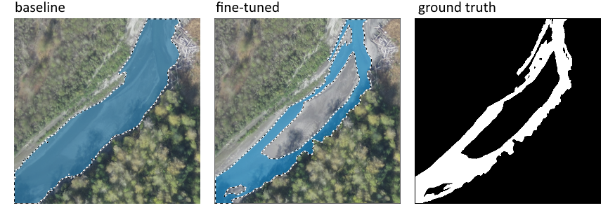
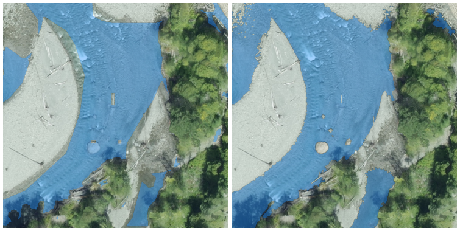
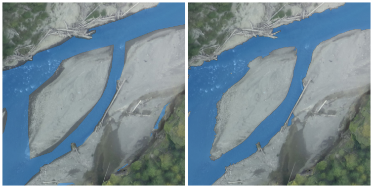
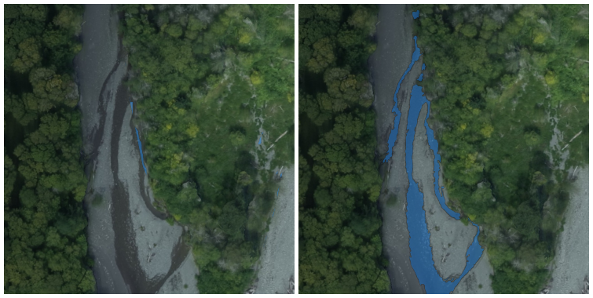

# Elwha Segmentation

This repository stores a computer vision workflow focused on image processing of remote sensing imagery from the Elwha river. The first portion relates to realigning offset image datasets, and the second portion involves fine-tuning Meta's SAM for bird's eye view river pixel segmentation.

## Dataset Realignment

This repository contains a python workflow for reconstruction of misaligned image datasets which span multiple colorspaces, and the application of these techniques on a specific dataset.

The dataset in question is made up of 812 RGB and IR aerial photographs taken from a plane flown over the Elwha river in 2012. The purpose of this project is to prepare the dataset for more advanced computer vision processing like cold water refuge mapping.

### Problem Statement

In order for more advanced processing tasks such as segmentation and classification to take place, there is a need to know for any given pixel in any given image both the RGB and IR data at that point. Unfortunately, the IR images are not only misaligned with the RGB images, they are also at a different scale and were shot with different camera settings/properties. 

See figure 1.A on alignment below. In order to (roughly) match the IR image to the RGB image, the IR image had to be shrunken despite the fact that the RBG and IR images seemingly have the same size of `640x480`. There is also still some distortion in the edges of the image.

Figure 1 | Figure 2
--- | --- 
 | 

To add even more complexity, images within the RBG and IR image sets are not all distinct, but rather overlap to a large degree, and the plane's flight trajectory means that from one image to the next we see rotation, translation, and scale variance at the same time. See figure 1.B below comparing `airborne_1.png` and `airborne_2.png`. Zone `A` is perfectly matched, which means zone `B` is imperfectly matched and zone `C` is completely misaligned. No matter where one attempts to match the images, without any projection it is impossible two images. Therefore, some sort of affine transformations will be necessary.

## River Segmentation

This repository contains a python workflow for fine-tuning public checkpoints of Meta's Segment Anything Model (SAM) for the purpose of automatically segmenting river pixels. There is a focus on experimental rigour, justifying all pipeline decisions and hyperparameters with experimental comparison.

### Dataset

The dataset is adapted from Daniel Buscombe's 2023 [publication](https://zenodo.org/records/10155783), although only the RGB images are maintained. Only about 200 of the original 4000+ images are used, and all of the ground truth masks have been replaced. This smaller version of the dataset with our improved segmentation masks can be found on HuggingFace at [stodoran/elwha-segmentation](https://huggingface.co/datasets/stodoran/elwha-segmentation). Below is a comparison of the original GT masks from Buscombe's dataset compared to our replacements.

The improved mask quality results in better fine-tuning performance, despite the vastly smaller dataset size. As visible from the samples, for some masks the correction is fairly minor. However there are some masks in the original dataset which accurately classify less than 10% of water pixels.

## Development Instructions

While image processing notebooks should likely be run locally, the fine-tuning notebook is set up so that it can be run in Google Colab. Since the notebook uses HuggingFace Accelerate, if launched on a VM with multiple GPUs the training can be distributed across all of them.

### Serving Locally

Activate the `elwha_env` conda environment. Navigate to the root folder of the repository in anaconda prompt. Run `python server.py`.

The server code can take a `--no-build` flag (or `--nb` shorthand) if you don't want to build any changes you've made to the notebooks, and this can just be run from a regular terminal.