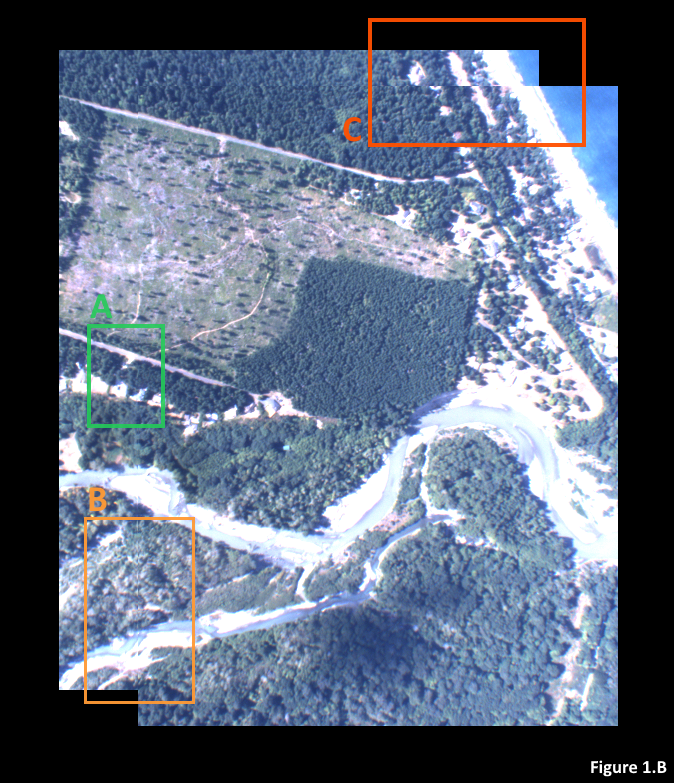

# Elwah Dataset Realignment

This repository stores a computer vision workflow for aligning offset image datasets which desccribe the same realworld objects but are in difference colorspaces.

## Introduction

This repository contains a python workflow for reconstruction of misaligned image datasets which span multiple colorspaces, and the application of these techniques on a specific dataset.

The dataset in question is made up of 812 RGB and IR aerial photographs taken from a plane flown over the Elwah river in 2012. The purpose of this project is to prepare the dataset for more advanced computer vision processing like cold water refuge mapping.

## Problem Statement

In order for more advanced processing such as classification tasks to take place, there is a need to know for any given pixel in any given image both the RGB and IR data at that point. Unfortunately, the IR images are not only misaligned with the RGB images, they are also at a different scale and were shot with different camera settings/properties. 

See figure 1.A on alignment below. In order to (roughly) match the IR image to the RGB image, the IR image had to be shrunken despite the fact that the RBG and IR images seemingly have the same size of `640x480`. There is also still some distortion in the edges of the image.

To add even more complexity, images within the RBG and IR image sets are not all distinct, but rather overlap to a large degree, and the plane's flight trajectory means that from one image to the next we see rotation, translation, and scale variance at the same time. See figure 1.B below comparing `airborne_1.png` and `airborne_2.png`. Zone `A` is perfectly matched, which means zone `B` is imperfectly matched and zone `C` is completely misaligned. No matter where one attempts to match the images, without any projection it is impossible two images. Therefore, some sort of affine transformations will be necessary.

## Serving

Activate the `elwah_env` conda environment. Navigate to the root folder of the repository in anaconda prompt. Run `python server.py`.

The server code can take a `--no-build` flag (or `--nb` shorthand) if you don't want to build any changes you've made to the notebooks, and this can just be run from a regular terminal.